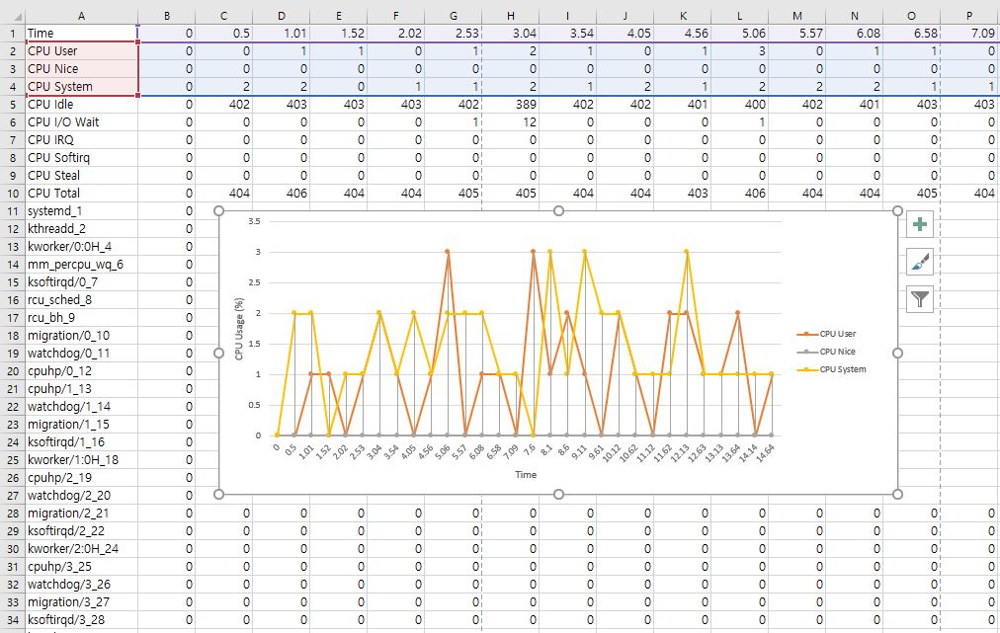

# cpu-usage-meter
CPU usage meter to generate a tab-separated file.

# How to use
```bash
make
./cpumeter
```
# Screenshot



# Reference
Please try to run `man proc` command. 
```bash
/proc/[PID]/stat.  (from Documentation/filesystems/proc.txt)

Table 1-3: Contents of the stat files (as of 2.6.22-rc3)
..............................................................................
Field          Content
 pid           process id
 tcomm         filename of the executable
 state         state (R is running, S is sleeping, D is sleeping in an
               uninterruptible wait, Z is zombie, T is traced or stopped)
 ppid          process id of the parent process
 pgrp          pgrp of the process
 sid           session id
 tty_nr        tty the process uses
 tty_pgrp      pgrp of the tty
 flags         task flags
 min_flt       number of minor faults
 cmin_flt      number of minor faults with child's
 maj_flt       number of major faults
 cmaj_flt      number of major faults with child's
 utime         user mode jiffies
 stime         kernel mode jiffies
 cutime        user mode jiffies with child's
 cstime        kernel mode jiffies with child's


#> cat /proc/stat
cpu  192369 7119 480152 122044337 14142 9937 26747 0 0

This tells you the cumulative CPU time that's been used in various categories, in units of jiffies. You need to take the sum of the values on this line to get a time_total measure.

Read both utime and stime for the process you're interested in, and read time_total from /proc/stat. Then sleep for a second or so, and read them all again. You can now calculate the CPU usage of the process over the sampling time, with:

user_util = 100 * (utime_after - utime_before) / (time_total_after - time_total_before);
sys_util = 100 * (stime_after - stime_before) / (time_total_after - time_total_before);

```
